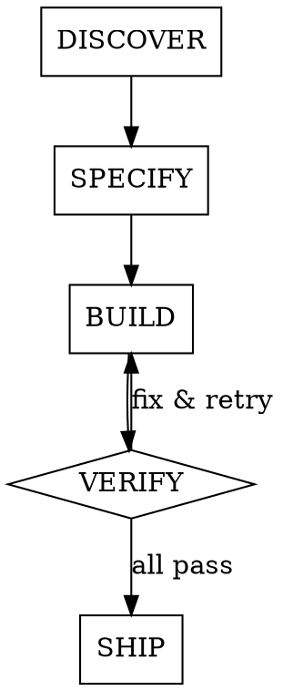

# Feature Pipeline

End-to-end orchestrator: idea → brainstorm → spec → build → verify → ship → record.

**Scope:** Use this for features requiring design decisions or multi-file changes. For trivial fixes (typos, single-value changes, one-file edits), use `/ship` directly — the full pipeline is overkill.

## Pipeline



---

## Phase 1: DISCOVER

1. Read project context: `UNIFIED-SPEC.md`, `docs/moodle-cloud-constraints.md`, `docs/PROJECT-TRACKER.md` (recent sessions for continuity)
2. **Moodle relevance check:** If the feature touches theme SCSS, CSS selectors, preview components, or Moodle UI → fetch official Moodle documentation via Context7 MCP:
   - `resolve-library-id` with `libraryName: "moodle"` and the user's idea as query
   - `query-docs` for MoodleCloud-specific constraints (Boost theme, SCSS fields, cache purging)
   - Cross-reference findings with `docs/moodle-cloud-constraints.md` — update the local doc if Context7 reveals new information
   - **Fallback:** If Context7 is unavailable (network error, timeout), proceed using `docs/moodle-cloud-constraints.md` as the sole Moodle reference. Warn the user that live docs could not be fetched.
3. **Invoke `superpowers:brainstorming`** — refine the idea collaboratively with the user. Follow brainstorming steps 1–4 (explore context, ask questions, propose approaches, present design). If the user rejects, iterate on steps 2–4 until approved.

**CRITICAL OVERRIDE:** When brainstorming reaches step 5 (write design doc) and step 6 (invoke writing-plans), do NOT execute those steps. Do NOT commit a design doc to the current branch. Do NOT invoke `superpowers:writing-plans`. The approved design will be captured in the feature MD in Phase 2. Return control to this skill.

4. Output: approved design concept (held in conversation context, not committed yet)

**HARD GATE:** Do NOT proceed to SPECIFY until the user approves the design from brainstorming.

---

## Phase 2: SPECIFY

**First, create the feature branch and worktree** so that all artifacts land on the correct branch:

1. **Invoke `superpowers:using-git-worktrees`** — create isolated worktree for the feature. This creates the `feat/<name>` branch.
2. **Inside the worktree**, write the feature spec to `docs/features/YYYY-MM-DD-<name>.md`:

```markdown
# Feature: <Name>
Date: YYYY-MM-DD
Status: draft
Branch: feat/<name>

## Problem
<1-2 sentences from brainstorm>

## Moodle Constraints
<Only if Moodle-relevant. Verified selectors, SCSS field rules, Context7 findings.>
<Omit this section entirely if not applicable.>

## Design
<Approved design from brainstorming phase — captures the full design rationale>

## Tasks
Each task MUST be independent unless explicitly blocked.

### Task 1: <title>
- **Files:** specific files to create/modify
- **Depends on:** none | Task N
- **Acceptance:** what "done" looks like

### Task 2: <title>
...

## Verification
<End-to-end checks to run after all tasks complete>
```

**Task rules:**
- Each task maps to exactly one agent
- List specific files per task — agents MUST NOT collide on the same file
- Minimize `Depends on` — truly independent tasks only
- If two tasks must edit the same file, merge them into one task
- Verification is a post-build step, not a task
- If the feature involved Moodle-specific constraints from DISCOVER, include relevant details in each task's description so subagents have the context they need

**HARD GATE:** User must approve the feature MD before proceeding to BUILD.

Update feature MD status: `draft` → `approved`

---

## Phase 3: BUILD

The worktree was already created in Phase 2. All work happens inside it.

1. **Invoke `superpowers:subagent-driven-development`** — pass the feature MD (`docs/features/YYYY-MM-DD-<name>.md`) as the implementation plan. Each `### Task N` maps to one agent.
2. Each agent receives:
   - Its specific task description + acceptance criteria from the feature MD
   - Instruction to follow `/build-component` patterns (CSS custom properties for preview, `aria-label` on interactive elements, Zustand for state, lucide-react for icons)
   - The project's code conventions from CLAUDE.md
   - **If the task involves visible UI** (new components, layout changes, visual features): invoke `frontend-design:frontend-design` to guide implementation quality — layout, visual hierarchy, interaction patterns, polish. This applies to most tasks in this project.

**CRITICAL OVERRIDE:** `subagent-driven-development` will attempt to invoke `superpowers:finishing-a-development-branch` after all tasks complete. Do NOT follow that path. Return control to this skill — Phase 4 (VERIFY) and Phase 5 (SHIP) replace `finishing-a-development-branch`.

**Execution model:** `subagent-driven-development` runs tasks sequentially with a review cycle per task: implementer → spec compliance review → code quality review. Each implementer commits its own work. This is intentional — it prevents file collisions and ensures code quality. For truly independent tasks that don't need review cycles, use `superpowers:dispatching-parallel-agents` instead.

Update feature MD status: `approved` → `in-progress`

---

## Phase 4: VERIFY

Each step is a **hard gate**. If any step fails → STOP, report the failure, fix the issue, and re-run the failed step. Do NOT proceed to the next step until the current one passes. Do NOT proceed to SHIP until ALL steps pass.

**Step 1 — Build gate (always):**
- `/verify-build` — `npm run build` must pass with zero errors
- If fails → fix build errors → re-run → must pass before Step 2

**Step 2 — Conditional gates** — auto-detect from the feature MD's file list:

| Files touched | Gates to run |
|---|---|
| `components/preview/*` | `/check-theme-accuracy` + `/brand-audit` |
| `lib/scss-generator.ts` | `/validate-scss-export` |
| `lib/tokens.ts` or `store/theme-store.ts` | `/brand-audit` |
| `components/controls/*` | `/brand-audit` (controls may introduce colour values) |
| Other files only | No additional gates |

Multiple categories can apply — run ALL matching gates. For example, a feature touching both `components/preview/` and `lib/scss-generator.ts` runs theme-accuracy + brand-audit + validate-scss.

- If any gate fails → fix → re-run that gate → must pass before Step 3

**Step 3 — Feature-specific verification:**
- Run the checks listed in the feature MD's `## Verification` section
- If any check fails → fix → re-run → must pass before Step 4

**Step 4 — Completion check:**
- **Invoke `superpowers:verification-before-completion`** — confirm all work is actually done before claiming success

---

## Phase 5: SHIP

Subagent implementers already committed their work during BUILD. This phase handles any remaining uncommitted changes (verification fixes, documentation updates) and pushes.

1. **Check for uncommitted changes:** Run `git status` in the worktree.
   - If there ARE uncommitted changes (verification fixes, feature MD status updates, etc.) → invoke `/ship` to stage, commit, and push
   - If the working tree is clean (subagents committed everything) → skip `/ship` commit step, just push:
     ```bash
     git push -u origin <current-branch>
     ```
2. **Update `docs/PROJECT-TRACKER.md`** — append a new session entry (commit this change):

```markdown
## Session: YYYY-MM-DD — <Feature Name>

### Feature: <Name>

<1-2 sentence summary of what was built>

### Files Created
| File | Purpose |
|---|---|
| ... | ... |

### Files Modified
| File | Changes |
|---|---|
| ... | ... |

### Build Status
- `npm run build` — zero errors
- `npm run lint` — zero warnings/errors

### Git Status
- **Branch:** feat/<name>
- **Commit:** `<hash>` — `<commit message>`
```

3. Update feature MD status: `in-progress` → `shipped`
4. Suggest: "Use `/review-pr` to create and review a PR before merging"

---

## Rules

- NEVER skip DISCOVER. Features that need design decisions go through brainstorming.
- NEVER skip SPECIFY. The feature MD is the contract for agents.
- NEVER skip VERIFY. Every step is a hard gate.
- NEVER ship without updating PROJECT-TRACKER.
- Feature MD status must progress: `draft` → `approved` → `in-progress` → `shipped`.
- ALL artifacts (feature MD, design notes, code) live in the worktree on the feature branch. NEVER commit to `main`.
- For trivial one-file fixes, use `/ship` directly instead of this pipeline.
