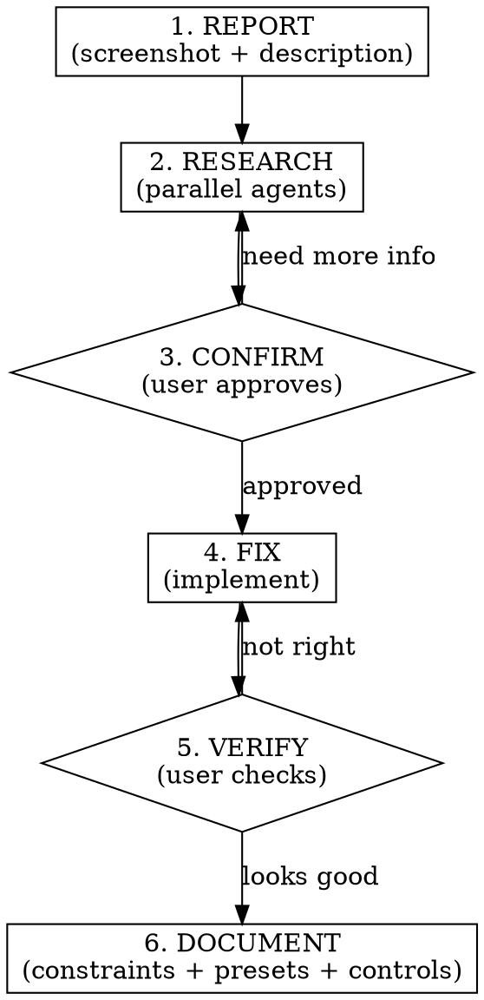

# Moodle Issue

Investigate and fix visual/colour/layout issues reported from the real CFA Moodle site.
Lightweight pipeline: research → confirm → fix → verify → document.

## Pipeline



---

## Phase 1: REPORT

Receive the user's input:
- **Screenshot** — read it with the Read tool (supports PNG/JPG)
- **Description** — what's wrong, which page, which element

Parse and identify:
- **Affected element(s):** navbar, card, button, text, background, etc.
- **Affected page(s):** dashboard, course, login, admin, etc.
- **Issue type:** wrong colour, invisible text, missing contrast, layout break, missing override, selector drift

Summarise the issue back to the user in one sentence before proceeding.

---

## Phase 2: RESEARCH

Dispatch **two agents in parallel** using the Task tool:

### Agent A — Official Moodle Documentation

Prompt:
> Research the following Moodle visual issue using Context7 MCP:
> - Element: {element}
> - Page: {page}
> - Issue: {description}
>
> 1. Call `resolve-library-id` with libraryName "moodle" and the issue as query
> 2. Call `query-docs` for relevant selectors, SCSS variables, or Boost theme behaviour
> 3. Use `WebSearch` to check for known Moodle tracker bugs or version-specific changes related to this element
>
> Return: confirmed selector(s), relevant SCSS variable(s), any version caveats, and whether this is a known Moodle behaviour or a bug.

**Fallback:** If Context7 MCP is unavailable (network error, timeout, no results), Agent A should fall back to `WebSearch` for Moodle documentation and known issues. If web search also fails, proceed using Agent B's local findings only. Warn the user that live Moodle docs could not be fetched.

### Agent B — Local Constraints & Codebase

Prompt:
> Investigate this visual issue against the local project:
> - Element: {element}
> - Page: {page}
> - Issue: {description}
>
> 1. Read `docs/moodle-cloud-constraints.md` — check if the selector/element is already documented, and whether existing overrides cover this case
> 2. Search `lib/scss-generator.ts` for how this element's SCSS is currently generated
> 3. Search `components/preview/` for how this element renders in the sandbox preview
> 4. Search `lib/tokens.ts` for `PRESET_TEMPLATES` to check if presets account for this element
> 5. Check the project's MEMORY.md (auto-loaded into conversation context) for any prior learnings about this element
>
> Return: whether the issue is known, current SCSS output for this element, current preview rendering, and which presets might be affected.

**After both agents return**, synthesise findings into a **fix plan**:
- Root cause (missing selector, wrong variable, hardcoded colour, etc.)
- Proposed SCSS change (Block 1 variable or Block 2 override)
- Files to modify (scss-generator, preview component, presets, constraints doc)
- Impact on other presets
- Whether new tokens or control panel changes are needed

---

## Phase 3: CONFIRM

Present the fix plan to the user. Include:
- What the research found (both agents)
- The proposed fix with code snippets
- Which files will change
- Which presets are affected

**HARD GATE:** Do NOT proceed until the user approves the fix plan.

---

## Phase 4: FIX

Implement the approved fix. Typical changes:

1. **SCSS generator** (`lib/scss-generator.ts`) — add/update selector or variable output
2. **Preview component** (`components/preview/*.tsx`) — fix rendering to use `var(--cfa-*)` (NEVER hardcode colours)
3. **Token definitions** (`lib/tokens.ts`) — add new token if needed
4. **Preset templates** (`PRESET_TEMPLATES` in `lib/tokens.ts`) — update ALL presets affected, not just the current one
5. **MoodleShell** (`components/preview/MoodleShell.tsx`) — add CSS custom property mapping if new token added

**New token checklist** (only if adding a token):
1. Define in `lib/tokens.ts` with a sensible default value
2. Add to Zustand store defaults in `store/theme-store.ts`
3. Add `--cfa-*` CSS variable mapping in `MoodleShell.tsx`
4. Add SCSS output in `lib/scss-generator.ts`
5. Set value in ALL affected presets (`PRESET_TEMPLATES` in `lib/tokens.ts`)
6. (Phase 6d) Evaluate control panel / quick palette exposure

**Rules:**
- ALL preview colours MUST use `var(--cfa-*)` — NEVER hardcode
- SCSS overrides in Block 2 often need `!important` due to Moodle Boost's high specificity. Known selectors requiring it: `.navbar.fixed-top`, `.secondary-navigation .nav-tabs .nav-link`, `#page-footer`. When in doubt, include `!important`
- If a new token is added, it must be included in the Zustand store defaults

After implementing, restart the dev server:
```bash
npm run dev
```

Tell the user the dev server is running and ask them to verify.

---

## Phase 5: VERIFY

**HARD GATE:** The user must confirm the fix looks correct in the live preview.

If the user says it doesn't look right:
- Ask what's still wrong
- Return to Phase 4 with the new information

If the user confirms it looks good → the fix is NOT complete yet. You MUST immediately proceed to Phase 6 DOCUMENT. Do NOT declare the issue resolved or respond to other user input until all Phase 6 sub-steps are done.

---

## Phase 6: DOCUMENT

**HARD GATE:** You are here because the user verified the fix. The issue is NOT resolved until all four sub-steps below are completed. Do not skip any.

All sub-steps are mandatory.

### 6a. Update `docs/moodle-cloud-constraints.md`

Add the new finding to the appropriate section:
- **New selector?** → Add to "Verified CSS Selectors" table (High/Medium confidence)
- **New variable behaviour?** → Add to "$primary Variable Propagation" or new subsection
- **New dark theme override?** → Follow the pattern in MEMORY.md section 7
- **Version caveat?** → Add to "Bootstrap 5 Migration Warning"

Include: the selector or variable, what it controls, whether `!important` is needed, which Moodle version this was verified on.

### 6b. Update MEMORY.md

Update MEMORY.md if ANY of these apply:
- **New token added** → add it to the Dark Theme Preset Creation Checklist (section 6) if dark-theme relevant
- **New selector category discovered** → add it to section 7 (Moodle Selectors That Need Dark Overrides)
- **Moodle version-specific behaviour found** → document it in the relevant section
- **Existing MEMORY.md entry needs correction** → update it

If none apply, state why briefly and move on.

### 6c. Update presets

Check ALL preset templates (`PRESET_TEMPLATES` in `lib/tokens.ts`). For each preset:
- Dark presets: does the new selector need a dark override?
- Light presets: does it need any override at all?
- Brand-specific presets: does the new token need a preset value?

Update every affected preset now — don't leave it for later.

### 6d. Update controls panel & quick palette

Check whether the fix introduced a new token or surfaced a colour that users should be able to customise:

1. **New token added?** → Does it need a control in the colour customisation panel (`components/controls/`)? Add a colour picker row if the token is user-facing (e.g., a new background, text colour, or accent that users would reasonably want to tweak).
2. **Quick palette** → Should this token appear in the quick palette for fast access? Add it if it's a frequently-adjusted colour (backgrounds, primary accents, text colours). Skip if it's a niche override most users won't touch.
3. **Existing controls affected?** → If the fix changed how an existing token behaves or renamed it, update the corresponding control label, tooltip, or grouping.

If no control/palette changes are needed, state why and move on.

### Completion check

Before declaring this issue resolved, confirm all four:
- [ ] 6a: constraints doc updated (or stated why no update needed)
- [ ] 6b: MEMORY.md updated (or stated why no update needed)
- [ ] 6c: ALL presets checked and updated
- [ ] 6d: controls/palette decision documented

Only after all four are checked may you tell the user the issue is fully resolved.

---

## Rules

- NEVER skip RESEARCH. Both agents must run.
- NEVER skip CONFIRM. User approval required before implementation.
- NEVER skip DOCUMENT. Every fix must be recorded in constraints doc, MEMORY.md, presets, and controls audit (all four sub-steps).
- NEVER hardcode colours in preview components. Use `var(--cfa-*)`.
- ALWAYS update ALL affected presets, not just the one the user is testing.
- ALWAYS restart the dev server after implementing changes.
- **Trivial fix shortcut:** If the fix changes a single property on a single already-documented selector, requires no new tokens, and affects no presets — you may abbreviate RESEARCH to Agent B only (skip external docs lookup) and shorten CONFIRM to a concise fix summary. The user MUST still explicitly approve before you implement. NEVER skip documentation.
